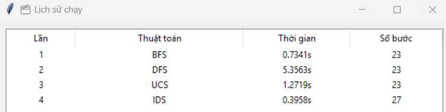
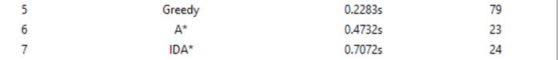
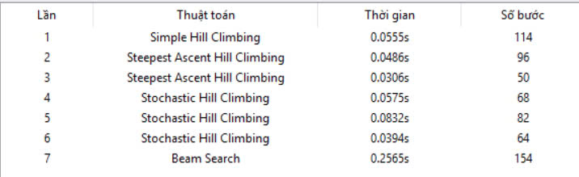

# 8puzzle-solver
## 1. Mục tiêu
Xây dựng một công cụ trực quan giúp người dùng giải bài toán 8-Puzzle bằng nhiều thuật toán tìm kiếm khác nhau, trong cả môi trường có thể quan sát và môi trường không có quan sát (sử dụng trạng thái niềm tin – Belief States).

## 2. Nội dung

### 2.1. Các thuật toán Tìm kiếm không có thông tin (BFS, DFS, IDS, UCS)

#### 2.1.1. Các thành phần chính của bài toán tìm kiếm
Trong bài toán 8-Puzzle, khi áp dụng các thuật toán tìm kiếm không có thông tin, các thành phần chính được xác định như sau:

Trạng thái (State) là một bảng 3x3 đại diện cho vị trí các ô số từ 1–8 và một ô trống (0).

Trạng thái ban đầu (Initial state):	Trạng thái đầu vào mà người chơi cung cấp.

Trạng thái đích (Goal state): Trạng thái mong muốn, thường là: [[1,2,3],[4,5,6],[7,8,0]]

Tập hành động (Actions): Các thao tác di chuyển ô trống: lên (↑), xuống (↓), trái (←), phải (→)

Hàm kế tiếp (Successor function):	Cho biết trạng thái mới sau khi thực hiện một hành động hợp lệ.

Kiểm tra mục tiêu (Goal test):	Kiểm tra xem trạng thái hiện tại có khớp với trạng thái đích không.

Chi phí bước đi (Path cost):	Mỗi bước đi có thể có chi phí bằng 1 (Uniform) hoặc tính riêng.

#### 2.1.2. Giải pháp (Solution) là gì?
Giải pháp là một chuỗi hành động (move sequence) từ trạng thái ban đầu đến trạng thái đích.

Ví dụ: [↓, →, ↓, ←, ...]

Trong giao diện chương trình, mỗi hành động được áp dụng và hiển thị kèm trạng thái tương ứng.

Một giải pháp tốt nên có ít bước và chi phí nhỏ nhất (nếu xét chi phí).

#### 2.1.3. Nhận xét về hiệu suất các thuật toán trong nhóm này

| Thuật toán | Ưu điểm                                                    | Nhược điểm                               | Quan sát thực tế                         |
| ---------- | ---------------------------------------------------------- | ---------------------------------------- | ---------------------------------------- |
| **BFS**    | Luôn tìm lời giải ngắn nhất (nếu chi phí bằng nhau)        | Tốn bộ nhớ nhiều                         | Mất \~0.73s, 23 bước                     |
| **DFS**    | Bộ nhớ thấp                                                | Dễ đi lạc, không đảm bảo lời giải tối ưu | Chậm hơn, mất \~5.35s                    |
| **UCS**    | Tìm được lời giải tối ưu nếu chi phí không bằng nhau       | Cần hàng đợi ưu tiên, bộ nhớ cao         | \~1.27s, giải đúng                       |
| **IDS**    | Kết hợp ưu điểm của DFS và BFS (ít bộ nhớ, đảm bảo tối ưu) | Tốn thời gian do lặp lại nhiều lần       | Nhanh (\~0.39s), nhưng dài hơn (27 bước) |

✅ Nhận xét tổng quan:
Với 8-Puzzle, do không gian trạng thái không quá lớn, BFS hoặc IDS thường là lựa chọn tốt.

DFS ít hiệu quả vì dễ đi sai hướng và tốn thời gian.

UCS hữu ích nếu bài toán có chi phí bước đi khác nhau.

IDS là lựa chọn hợp lý nếu muốn giảm bộ nhớ mà vẫn tìm được lời giải ngắn.

### 2.2. Các thuật toán Tìm kiếm có thông tin (A* Search, IDA*, Greedy Best-First Search)

| Thuật toán                   | Ưu điểm nổi bật                                               | Nhược điểm                                              | Quan sát thực tế                                      |
| ---------------------------- | ------------------------------------------------------------- | ------------------------------------------------------- | ----------------------------------------------------- |
| **Greedy Best-First Search** | Nhanh, thường tìm lời giải sớm nhờ heuristic (hàm đánh giá)   | Không đảm bảo tìm lời giải tối ưu (chọn ngắn nhưng sai) | Thời gian thấp (\~0.23s), nhưng dài tới 79 bước       |
| **A\***                      | Tìm lời giải ngắn nhất nếu heuristic tốt (tối ưu, hoàn chỉnh) | Cần nhiều bộ nhớ để lưu tất cả trạng thái duyệt qua     | Cân bằng giữa tốc độ và chất lượng (\~0.47s, 23 bước) |
| **IDA\***                    | Kết hợp độ sâu và heuristic → giảm bộ nhớ so với A\*          | Có thể chạy lại nhiều lần → tốn thời gian hơn A\*       | Kết quả đúng (24 bước), thời gian \~0.70s             |

✅ Tổng kết:

Greedy tuy nhanh nhất nhưng tạo ra lời giải kém chất lượng nhất (nhiều bước) do chỉ quan tâm đến heuristic mà bỏ qua chi phí thực.

A* là lựa chọn tối ưu nhất trong trường hợp này: vừa nhanh, vừa tìm lời giải ngắn.

IDA* là một thay thế cho A* khi bộ nhớ hạn chế, chấp nhận thời gian lâu hơn một chút.

🧠 Ghi chú:

Tất cả các thuật toán này dùng heuristic, phổ biến nhất là:

h(n) = tổng khoảng cách Manhattan từ mỗi ô về đúng vị trí trong goal.

A*, IDA* dùng f(n) = g(n) + h(n)

Greedy chỉ dùng f(n) = h(n)

### 2.3. Các thuật toán Tìm kiếm cục bộ
(Simple Hill Climbing, Steepest Ascent Hill Climbing, Stochastic Hill Climbing, Simulated Annealing, Local Beam Search, Genetic Algorithm)

📌 Nhận xét về hiệu suất khi áp dụng vào trò chơi 8 ô chữ:

| Thuật toán                        | Ưu điểm                                             | Nhược điểm                                                         | Quan sát thực tế                              |
| --------------------------------- | --------------------------------------------------- | ------------------------------------------------------------------ | --------------------------------------------- |
| **Simple Hill Climbing**          | Cách cài đặt đơn giản, chạy nhanh                   | Dễ kẹt ở local maxima, không đảm bảo tìm được lời giải             | Nhanh (\~0.05s), giải không tối ưu (114 bước) |
| **Steepest Ascent Hill Climbing** | Cải tiến hơn: chọn nước đi tốt nhất trong hàng xóm  | Vẫn có thể kẹt nếu tất cả hàng xóm kém hơn                         | Thường giải được, bước dao động (50–96 bước)  |
| **Stochastic Hill Climbing**      | Chọn ngẫu nhiên hàng xóm tốt hơn → giảm nguy cơ kẹt | Không đảm bảo tối ưu, kết quả không ổn định giữa các lần chạy      | Đa số giải được, bước dao động (64–82 bước)   |
| **Beam Search**                   | Duy trì nhiều trạng thái tốt nhất → giảm kẹt local  | Cần chọn `k` hợp lý, vẫn có thể lặp và sai hướng                   | Chạy được, nhưng giải kém (154 bước)          |
| **Simulated Annealing**           | Cho phép "nhảy có kiểm soát" ra khỏi local minima   | Phụ thuộc nhiều vào tham số nhiệt độ, dễ sai nếu cấu hình chưa tốt | Hiếm khi giải được nếu không tối ưu tham số   |
| **Genetic Algorithm**             | Khám phá mạnh nhờ đột biến và lai ghép              | Ngẫu nhiên cao, không đảm bảo tìm ra lời giải, cần thử nhiều lần   | Rất hiếm khi giải ra, kết quả không ổn định   |

✅ Tổng kết:

Các thuật toán cục bộ rất phù hợp để chạy nhanh trên không gian lớn, nhưng không đảm bảo luôn tìm được lời giải, nhất là khi:

Không có cơ chế thoát khỏi local minima

Hoặc khi heuristic không đủ dẫn hướng

Steepest Ascent HC và Stochastic HC là những lựa chọn khá hiệu quả, nhưng vẫn phụ thuộc vào may rủi và cấu hình. Steepest HC bị kẹt nếu không có hàng xóm nào tốt hơn. Stochastic HC ngẫu nhiên nên có thể không chọn đúng hướng tốt nhất.

Simulated Annealing và Genetic Algorithm cần tối ưu tham số, chạy nhiều lần, và vẫn không đảm bảo thành công.

### 2.4. Tìm kiếm mà không quan sát: Trạng thái niềm tin (Belief State)

#### 2.4.1. Các thành phần chính của bài toán tìm kiếm (trong môi trường không quan sát)

| Thành phần                                        | Mô tả                                                                                                                                                        |
| ------------------------------------------------- | ------------------------------------------------------------------------------------------------------------------------------------------------------------ |
| **Trạng thái ban đầu (Initial State)**            | Là **một tập hợp các trạng thái có thể** xảy ra, vì agent không biết chắc mình đang ở đâu. Đây được gọi là **trạng thái niềm tin (belief state)**.           |
| **Trạng thái đích (Goal State)**                  | Cũng là một tập hợp các trạng thái được chấp nhận là mục tiêu. Agent phải chắc chắn rằng mình đã vào một trong các trạng thái này sau khi kết thúc kế hoạch. |
| **Trạng thái hiện tại (Current Belief State)**    | Tại mọi thời điểm, agent không biết đang ở trạng thái nào, mà chỉ biết đang nằm trong **một tập trạng thái khả dĩ**.                                         |
| **Tập hành động (Actions)**                       | Tập các hành động áp dụng được trong môi trường (ví dụ: di chuyển ô trống lên, xuống, trái, phải).                                                           |
| **Hàm kế tiếp (Transition / Successor function)** | Một hành động được áp dụng lên tất cả các trạng thái trong belief state hiện tại để tạo ra belief state mới.                                                 |
| **Kiểm tra mục tiêu (Goal Test)**                 | Một belief state là đạt mục tiêu nếu **toàn bộ các trạng thái trong nó nằm trong tập goal**. Tức là: `belief_state ⊆ goal_set`.                              |
| **Chi phí (Cost)**                                | Mỗi hành động có thể có chi phí cố định (ví dụ: 1). Tổng chi phí là độ dài của kế hoạch.                                                                     |

#### 2.4.2. Giải pháp (Solution) là gì?

Trong tìm kiếm không quan sát, solution là một chuỗi hành động (kế hoạch) [a1, a2, ..., an] thỏa mãn: Sau khi thực hiện các hành động này, bất kể trạng thái ban đầu là gì, agent chắc chắn sẽ kết thúc ở một trạng thái nằm trong tập goal.

Cụ thể: apply(plan, initial_beliefs) ⊆ goal_beliefs

Tức là: nếu bắt đầu từ bất kỳ trạng thái nào trong initial_beliefs, sau khi thực hiện chuỗi hành động, tất cả trạng thái khả dĩ phải thuộc goal_beliefs.

📌 Khác biệt so với tìm kiếm thông thường:

| Thuộc tính          | Tìm kiếm quan sát được                  | Tìm kiếm không quan sát                       |
| ------------------- | --------------------------------------- | --------------------------------------------- |
| Trạng thái hiện tại | Biết chính xác                          | Không biết chính xác                          |
| Hành động phản hồi  | Có thể điều chỉnh theo kết quả quan sát | Không thể điều chỉnh (vì không quan sát được) |
| Kế hoạch            | Có thể phân nhánh (contingent)          | Phải cố định cho mọi khả năng (conformant)    |

🧠 Ví dụ minh họa đơn giản (8-Puzzle): Cần tìm một chuỗi hành động duy nhất sao cho: sau khi áp dụng nó lên mọi khả năng, tất cả kết quả đều đúng đích.

### 2.5. Tìm kiếm với quan sát một phần: Trạng thái niềm tin (Belief State)

#### 2.5.1. Các thành phần chính của bài toán tìm kiếm

Trong môi trường quan sát một phần, agent chỉ biết một phần trạng thái ban đầu, và sẽ dần cập nhật niềm tin (belief state) khi nhận được các quan sát sau mỗi hành động.

| Thành phần                                                                                                                                                                                                                      | Mô tả                                                                                                                              |
| ------------------------------------------------------------------------------------------------------------------------------------------------------------------------------------------------------------------------------- | ---------------------------------------------------------------------------------------------------------------------------------- |
| **Trạng thái thật (Actual state)**                                                                                                                                                                                              | Trạng thái thực tế mà agent đang ở trong, nhưng không biết hoàn toàn.                                                              |
| **Trạng thái niềm tin (Belief state)**                                                                                                                                                                                          | Tập hợp các trạng thái mà agent **tin rằng có thể mình đang ở đó**, dựa trên phần thông tin đã biết và quan sát sau mỗi hành động. |
| **Trạng thái ban đầu (Initial belief)**                                                                                                                                                                                         | Là tập hợp các trạng thái có chung phần đã biết.                                                                                   |
| → Ví dụ: nếu biết 3 phần tử đầu tiên của hàng đầu là `[2, 6, 5]`, thì agent sẽ sinh tất cả các trạng thái 8-Puzzle có hàng đầu là `[2, 6, 5]`, và phần còn lại là mọi hoán vị hợp lệ của các số còn lại (`{0, 1, 3, 4, 7, 8}`). |                                                                                                                                    |
| **Tập hành động (Actions)**                                                                                                                                                                                                     | Các thao tác di chuyển ô trống (lên, xuống, trái, phải).                                                                           |
| **Tập quan sát (Observations)**                                                                                                                                                                                                 | Sau mỗi hành động, agent nhận được thông tin một phần về trạng thái mới (ví dụ: nhìn thấy các ô xung quanh ô trống).               |
| **Hàm kế tiếp (Transition function)**                                                                                                                                                                                           | Cho biết các trạng thái mới có thể sau khi thực hiện hành động.                                                                    |
| **Hàm quan sát (Observation function)**                                                                                                                                                                                         | Dựa vào trạng thái thật, trả về một quan sát cụ thể mà agent nhìn thấy được.                                                       |
| **Hàm cập nhật niềm tin (Belief update)**                                                                                                                                                                                       | Dựa vào hành động vừa thực hiện và quan sát nhận được → loại bỏ các trạng thái không phù hợp khỏi belief state.                    |
| **Trạng thái mục tiêu (Goal states)**                                                                                                                                                                                           | Tập hợp các trạng thái được xem là hoàn thành mục tiêu.                                                                            |
| **Kiểm tra mục tiêu (Goal test)**                                                                                                                                                                                               | Khi belief state chỉ còn các trạng thái thuộc goal → xem là đã hoàn thành.                                                         |

#### 2.5.2. Solution là gì?

Solution là một kế hoạch có điều kiện (contingent plan), gồm các hành động và nhánh rẽ theo quan sát, giúp agent từ trạng thái niềm tin ban đầu dần thu hẹp tới trạng thái goal.

Tức là:

&nbsp;&nbsp;Không phải một chuỗi cố định [a1, a2, ..., an]

&nbsp;&nbsp;Mà là một cây kế hoạch dạng:

&nbsp;&nbsp;&nbsp;&nbsp;Thực hiện a1

&nbsp;&nbsp;&nbsp;&nbsp;&nbsp;→ nếu quan sát o1: làm a2

&nbsp;&nbsp;&nbsp;&nbsp;&nbsp;→ nếu quan sát o2: làm a3

&nbsp;&nbsp;&nbsp;&nbsp;&nbsp;...

Kế hoạch phải đảm bảo rằng: Dù agent bắt đầu ở bất kỳ trạng thái nào phù hợp với thông tin ban đầu, sau một chuỗi hành động và quan sát, agent sẽ biết chắc mình đang ở trạng thái goal.

### 2.6. Tìm kiếm với các hành động không xác định: Cây tìm kiếm And-Or

#### 2.6.1. Các thành phần chính của bài toán tìm kiếm (với hành động không xác định)

Trong môi trường này, một hành động không luôn tạo ra kết quả duy nhất. Thay vào đó, mỗi hành động có thể dẫn tới nhiều trạng thái khác nhau, gọi là các kết quả khả dĩ (possible outcomes).

| Thành phần                                      | Mô tả                                                                         |
| ----------------------------------------------- | ----------------------------------------------------------------------------- |
| **Trạng thái (State)**                          | Là cấu hình của thế giới hiện tại (ví dụ: trạng thái 8-Puzzle).               |
| **Trạng thái ban đầu (Initial state)**          | Trạng thái xuất phát của agent.                                               |
| **Tập hành động (Actions)**                     | Các thao tác mà agent có thể thực hiện.                                       |
| **Hàm chuyển trạng thái (Transition function)** | Với mỗi `(state, action)`, có thể trả về **nhiều trạng thái kết quả khả dĩ**. |
| Ví dụ: `Result(s, a) = {s1, s2}`.               |                                                                               |
| **Kiểm tra mục tiêu (Goal test)**               | Kiểm tra xem trạng thái hiện tại có nằm trong tập goal không.                 |
| **Chi phí bước đi (Cost)**                      | Có thể tính theo hành động hoặc theo xác suất.                                |

❗ Hành động không xác định là gì?

Một hành động có thể dẫn tới nhiều trạng thái khác nhau, không chắc chắn trước khi thực hiện.

Ví dụ trong robot: "di chuyển lên" → có thể thành công hoặc trượt sang phải.

#### 2.6.2. Solution là gì?

Solution là một cây kế hoạch có nhánh, gọi là And-Or search tree.

Tại mỗi nút OR: agent chọn một hành động

Tại mỗi nhánh AND: mô hình hóa tất cả kết quả có thể của hành động đó

Kế hoạch chỉ được chấp nhận nếu tất cả các nhánh của mọi AND-node dẫn đến goal

→ tức là đảm bảo thành công trong mọi tình huống bất định

📘 Ví dụ:

Giả sử:

Trạng thái ban đầu là s0

Thực hiện hành động a1 có thể dẫn đến {s1, s2}

Kế hoạch phải xử lý được cả s1 và s2

Cây sẽ trông như:

s0

└── a1 (OR)

    ├── s1 (AND) ──> kế hoạch tiếp theo cho s1

    └── s2 (AND) ──> kế hoạch tiếp theo cho s2

✅ Chỉ khi cả s1 và s2 đều có kế hoạch đến goal, thì kế hoạch từ s0 mới được chấp nhận.

### 2.7. Constraint Satisfaction Problem (CSP): AC-3

#### 2.7.1. Các thành phần chính của bài toán tìm kiếm trong CSP

Một bài toán ràng buộc (CSP) không tìm kiếm theo hành động từng bước như 8-Puzzle, mà thay vào đó là tìm giá trị cho biến sao cho thỏa mãn ràng buộc. Thành phần của một CSP gồm:

| Thành phần                      | Mô tả                                                            |
| ------------------------------- | ---------------------------------------------------------------- |
| **Tập biến (Variables)**        | Các biến cần gán giá trị. Ví dụ: `X1, X2, ..., Xn`.              |
| **Miền giá trị (Domains)**      | Với mỗi biến, một tập các giá trị khả dĩ. Ví dụ: `X1 ∈ {1,2,3}`. |
| **Tập ràng buộc (Constraints)** | Các điều kiện mà các biến phải thỏa mãn. |

📘 Ví dụ đơn giản:

&nbsp;&nbsp;&nbsp;Biến: A, B, C

&nbsp;&nbsp;&nbsp;Miền: {1, 2, 3}

&nbsp;&nbsp;&nbsp;Ràng buộc:

&nbsp;&nbsp;&nbsp;&nbsp;&nbsp;&nbsp;A ≠ B

&nbsp;&nbsp;&nbsp;&nbsp;&nbsp;&nbsp;B ≠ C

&nbsp;&nbsp;&nbsp;&nbsp;&nbsp;&nbsp;A ≠ C

&nbsp;&nbsp;&nbsp;👉 Bài toán yêu cầu tìm giá trị cho A, B, C sao cho không có 2 biến nào trùng nhau.

#### 2.7.2. Thuật toán AC-3 là gì ?

AC-3 (Arc Consistency 3) là một thuật toán lọc miền giá trị để đơn giản hóa CSP trước khi tìm lời giải, bằng cách loại bỏ những giá trị chắc chắn không thể được chọn.

📌 Cơ chế hoạt động của AC-3:

&nbsp;&nbsp;&nbsp;Xét tất cả các cặp biến có ràng buộc (Xi, Xj)

&nbsp;&nbsp;&nbsp;Với mỗi cặp, kiểm tra xem tất cả giá trị trong Xi có “hợp lệ” với ít nhất 1 giá trị của Xj không

&nbsp;&nbsp;&nbsp;Nếu có giá trị trong miền Xi mà không còn tương thích với Xj nào → loại bỏ nó khỏi miền Xi

&nbsp;&nbsp;&nbsp;Quá trình này lặp lại cho đến khi không còn thay đổi nào.

#### 2.7.3. Solution là gì ?

Solution của bài toán CSP là một ánh xạ từ biến → giá trị, sao cho tất cả các ràng buộc được thỏa mãn.

Nếu dùng AC-3:

&nbsp;&nbsp;&nbsp;Có thể đơn giản bài toán trước bằng cách giảm miền

&nbsp;&nbsp;&nbsp;Sau đó kết hợp với các kỹ thuật khác như Backtracking, Forward Checking để tìm lời giải đầy đủ

🧠 Tóm tắt:

| Thành phần  | Ý nghĩa trong CSP                                          |
| ----------- | ---------------------------------------------------------- |
| Variables   | Các biến cần gán giá trị                                   |
| Domains     | Tập giá trị hợp lệ ban đầu của mỗi biến                    |
| Constraints | Các điều kiện giữa các biến                                |
| AC-3        | Bộ lọc kiểm tra và cắt giảm miền không cần thiết           |
| Solution    | Gán giá trị cho mọi biến sao cho tất cả ràng buộc đều đúng |

### 2.8. Constraint Satisfaction Problem (CSP): Forward Checking

#### 2.8.1. Các thành phần chính của bài toán tìm kiếm CSP

Bài toán CSP (Constraint Satisfaction Problem – bài toán thỏa mãn ràng buộc) là một dạng bài toán trong trí tuệ nhân tạo, trong đó cần tìm giá trị phù hợp cho tập biến sao cho thỏa mãn tất cả các ràng buộc đã cho.

| Thành phần                      | Mô tả                                                                                                  |
| ------------------------------- | ------------------------------------------------------------------------------------------------------ |
| **Tập biến (Variables)**        | Các biến cần được gán giá trị, ví dụ: `X1, X2, ..., Xn`.                                               |
| **Miền giá trị (Domains)**      | Mỗi biến có một tập giá trị hợp lệ ban đầu. Ví dụ: `X1 ∈ {1, 2, 3}`.                                   |
| **Tập ràng buộc (Constraints)** | Các điều kiện giữa các biến. Ví dụ: `X1 ≠ X2`, `X1 + X2 = X3`, `alldiff(X1, X2, X3)`.                  |
| **Mục tiêu (Goal)**             | Tìm được một ánh xạ (assignment) từ biến → giá trị sao cho **tất cả các ràng buộc đều được thỏa mãn**. |

#### 2.8.2. Forward Checking là gì ?

Forward Checking (FC) là một kỹ thuật hỗ trợ trong quá trình tìm kiếm lời giải CSP, dùng để phát hiện mâu thuẫn sớm bằng cách cập nhật miền (domain) của các biến chưa gán ngay sau mỗi lần gán.

📘 Cách hoạt động của Forward Checking:
&nbsp;&nbsp;&nbsp;Khi gán một giá trị cho biến X, Forward Checking sẽ:

&nbsp;&nbsp;&nbsp;Dò qua các biến chưa gán nhưng có ràng buộc với X

&nbsp;&nbsp;&nbsp;Loại bỏ khỏi domain của các biến đó những giá trị không còn hợp lệ (dẫn đến vi phạm ràng buộc)

&nbsp;&nbsp;&nbsp;Nếu một biến bị rút gọn domain về rỗng, thì biết rằng lựa chọn hiện tại là sai → backtrack sớm

🧠 Ví dụ đơn giản:

&nbsp;&nbsp;&nbsp;Biến: A, B, C

&nbsp;&nbsp;&nbsp;Miền: {1, 2, 3}

&nbsp;&nbsp;&nbsp;Ràng buộc: A ≠ B, B ≠ C, A ≠ C

&nbsp;&nbsp;&nbsp;Quá trình:

&nbsp;&nbsp;&nbsp;&nbsp;&nbsp;&nbsp;Gán A = 1

&nbsp;&nbsp;&nbsp;&nbsp;&nbsp;&nbsp;FC sẽ:

&nbsp;&nbsp;&nbsp;&nbsp;&nbsp;&nbsp;&nbsp;&nbsp;&nbsp;Loại 1 khỏi domain của B và C

&nbsp;&nbsp;&nbsp;&nbsp;&nbsp;&nbsp;&nbsp;&nbsp;&nbsp;Nếu còn domain hợp lệ → tiếp tục

&nbsp;&nbsp;&nbsp;&nbsp;&nbsp;&nbsp;&nbsp;&nbsp;&nbsp;Nếu có domain nào rỗng → backtrack

#### 2.8.3. Solution là gì ?

Solution của bài toán CSP khi dùng Forward Checking là một gán giá trị hoàn chỉnh cho tất cả các biến sao cho mọi ràng buộc đều được thỏa mãn.

Forward Checking không thay đổi định nghĩa solution, mà chỉ tăng hiệu quả tìm kiếm bằng cách:

&nbsp;&nbsp;&nbsp;Dò mâu thuẫn sớm

&nbsp;&nbsp;&nbsp;Cắt nhánh tìm kiếm không cần thiết

&nbsp;&nbsp;&nbsp;Kết hợp tốt với Backtracking

### 2.9. Constraint Satisfaction Problem (CSP): Backtracking

#### 2.9.1. Các thành phần chính của bài toán tìm kiếm CSP

Trong CSP (Constraint Satisfaction Problem), bài toán được định nghĩa bằng ba thành phần cơ bản:

| Thành phần                      | Mô tả                                                                                                    |
| ------------------------------- | -------------------------------------------------------------------------------------------------------- |
| **Tập biến (Variables)**        | Các biến cần được gán giá trị. Ví dụ: `X1, X2, ..., Xn`.                                                 |
| **Miền giá trị (Domains)**      | Tập giá trị khả dĩ cho mỗi biến. Ví dụ: `X1 ∈ {1, 2, 3}`.                                                |
| **Tập ràng buộc (Constraints)** | Các điều kiện cần được thỏa mãn giữa các biến, ví dụ: `X1 ≠ X2`, `X3 + X4 = 5`, `alldiff(X1, X2, X3)`... |
| **Mục tiêu (Goal)**             | Tìm một gán giá trị cho tất cả các biến sao cho **tất cả các ràng buộc đều được thỏa mãn**.              |

#### 2.9.2. Backtracking là gì ?

Backtracking là một kỹ thuật giải bài toán CSP bằng cách gán giá trị tuần tự cho từng biến, và lùi lại (backtrack) khi phát hiện vi phạm ràng buộc.

📘 Cách hoạt động:
&nbsp;&nbsp;&nbsp;Bắt đầu với biến đầu tiên chưa gán

&nbsp;&nbsp;&nbsp;Thử từng giá trị trong domain

&nbsp;&nbsp;&nbsp;Kiểm tra ràng buộc với các biến đã gán

&nbsp;&nbsp;&nbsp;Nếu hợp lệ → tiếp tục với biến kế tiếp

&nbsp;&nbsp;&nbsp;Nếu không có giá trị hợp lệ → quay lui (backtrack) về biến trước để thử giá trị khác

🧠 Ví dụ đơn giản:
&nbsp;&nbsp;&nbsp;Biến: A, B, C

&nbsp;&nbsp;&nbsp;Miền: {1, 2, 3}

&nbsp;&nbsp;&nbsp;Ràng buộc: A ≠ B, B ≠ C, A ≠ C

&nbsp;&nbsp;&nbsp;Quy trình:

&nbsp;&nbsp;&nbsp;&nbsp;&nbsp;&nbsp;Gán A = 1

&nbsp;&nbsp;&nbsp;&nbsp;&nbsp;&nbsp;Gán B = 2 → hợp lệ

&nbsp;&nbsp;&nbsp;&nbsp;&nbsp;&nbsp;Gán C = 1 → vi phạm A ≠ C

&nbsp;&nbsp;&nbsp;&nbsp;&nbsp;&nbsp;Backtrack: thử C = 3 → hợp lệ → kết thúc

#### 2.9.3. Solution là gì ?

Solution là một ánh xạ đầy đủ từ biến → giá trị sao cho tất cả ràng buộc được thỏa mãn.

🔍 Đặc điểm của Backtracking:

| Ưu điểm                                    | Nhược điểm                          |
| ------------------------------------------ | ----------------------------------- |
| Đơn giản, dễ cài đặt                       | Có thể duyệt qua nhiều nhánh vô ích |
| Luôn tìm được lời giải nếu có              | Tốc độ chậm nếu không có cải tiến   |
| Kết hợp tốt với kỹ thuật khác như FC, AC-3 | Không tối ưu về thời gian           |

### 2.10. Reinforcement Learning (Học tăng cường): Q-learning

#### 2.10.1. Các thành phần chính của bài toán học tăng cường (Reinforcement Learning)

Trong học tăng cường, một agent (tác tử) học cách hành động tối ưu thông qua tương tác với môi trường, thông qua phần thưởng (reward).

Bài toán được mô hình hóa thành một MDP (Markov Decision Process) với các thành phần chính:

| Thành phần                                          | Mô tả                                                                                         |
| --------------------------------------------------- | --------------------------------------------------------------------------------------------- |
| **Tập trạng thái (States – S)**                     | Tập hợp tất cả các trạng thái mà agent có thể gặp.                                            |
| **Tập hành động (Actions – A)**                     | Tập các hành động mà agent có thể thực hiện ở mỗi trạng thái.                                 |
| **Hàm chuyển trạng thái (Transition function – T)** | Xác suất chuyển từ trạng thái này sang trạng thái khác sau khi thực hiện một hành động:       |
| \`P(s'                                              | s, a)\`                                                                                       |
| **Hàm phần thưởng (Reward function – R)**           | Cho biết phần thưởng agent nhận được khi thực hiện hành động `a` tại trạng thái `s`:          |
| `R(s, a)` hoặc `R(s, a, s')`                        |                                                                                               |
| **Chính sách (Policy – π)**                         | Một chiến lược xác định hành động cần thực hiện tại mỗi trạng thái.                           |
| **Mục tiêu (Goal)**                                 | Tìm chính sách tối ưu π\* để **tối đa hóa tổng phần thưởng kỳ vọng tích lũy theo thời gian**. |

📘 Q-learning là gì?: Q-learning là một thuật toán học tăng cường không cần biết trước mô hình môi trường (model-free), dùng để ước lượng giá trị tối ưu của cặp trạng thái-hành động: Q(s, a)

📌 Công thức cập nhật Q-learning: 

Sau khi agent thực hiện hành động a tại trạng thái s, nhận phần thưởng r và chuyển đến trạng thái mới s', ta cập nhật:

&nbsp;&nbsp;&nbsp;Q(s, a) ← Q(s, a) + α [r + γ * max_a' Q(s', a') - Q(s, a)]

Trong đó:

&nbsp;&nbsp;&nbsp;α là learning rate (tốc độ học)

&nbsp;&nbsp;&nbsp;γ là discount factor (mức độ ưu tiên tương lai)

&nbsp;&nbsp;&nbsp;max_a' Q(s', a') là giá trị hành động tốt nhất ở trạng thái kế tiếp

#### 2.10.2. Solution là gì ?

Solution trong Q-learning là bảng Q(s, a) – chứa giá trị kỳ vọng của việc thực hiện hành động a tại trạng thái s.

Từ bảng Q, ta xây dựng chính sách tối ưu: π*(s) = argmax_a Q(s, a)

Tức là: tại mỗi trạng thái, chọn hành động có giá trị Q lớn nhất.

🔁 Q-learning hoạt động như thế nào?

&nbsp;&nbsp;&nbsp;Bắt đầu ở một trạng thái s

&nbsp;&nbsp;&nbsp;Chọn hành động a (theo chính sách ε-greedy)

&nbsp;&nbsp;&nbsp;Thực hiện a, nhận r, chuyển đến s'

&nbsp;&nbsp;&nbsp;Cập nhật Q(s, a) bằng công thức học

&nbsp;&nbsp;&nbsp;Lặp lại cho nhiều bước / tập huấn luyện

## 3. Kết luận

🎯 Một số kết quả đạt được khi thực hiện project này:

### 3.1. Hiểu rõ và áp dụng nhiều nhóm thuật toán tìm kiếm khác nhau

Đã triển khai và so sánh các thuật toán tìm kiếm trong môi trường quan sát đầy đủ, gồm:

Tìm kiếm không thông tin: BFS, DFS, IDS, UCS

Tìm kiếm có thông tin: A*, Greedy Best-First Search, IDA*

Tìm kiếm cục bộ: Hill Climbing (Simple, Steepest, Stochastic), Simulated Annealing, Genetic Algorithm

### 3.2. Mô phỏng được bài toán trong môi trường không chắc chắn

Cài đặt được phiên bản 8-Puzzle trong môi trường không có quan sát bằng cách sử dụng trạng thái niềm tin (belief states):

Cho phép nhập nhiều trạng thái ban đầu và trạng thái đích

Áp dụng thuật toán BFS trên tập belief

Trả về kế hoạch đảm bảo mọi trạng thái ban đầu đều đến goal

### 3.3. Hiện thực giao diện tương tác bằng Python

Xây dựng giao diện bằng Tkinter cho phép:

Nhập trực tiếp trạng thái ban đầu và đích

Chọn thuật toán để giải

Hiển thị từng bước di chuyển và kết quả trực quan

Hỗ trợ nhập nhiều belief states khi chọn tìm kiếm không quan sát

### 3.4. Khả năng phân tích, đánh giá và so sánh thuật toán

Đã thực hiện nhiều lần chạy để:

So sánh tốc độ, số bước, độ ổn định

Ghi nhận trường hợp các thuật toán thất bại (ví dụ: SA và GA hiếm khi tìm ra lời giải)

Rút ra ưu và nhược điểm của từng thuật toán qua thực nghiệm thực tế

